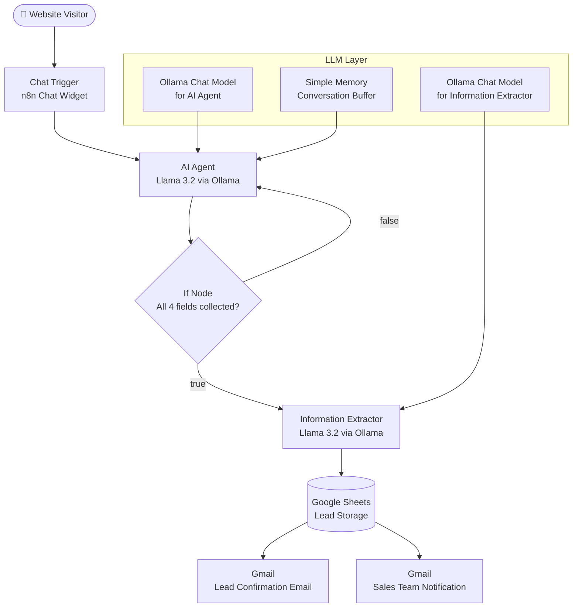
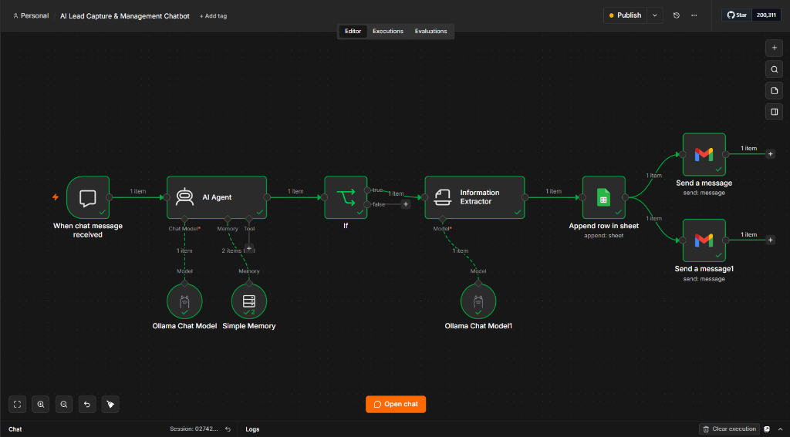
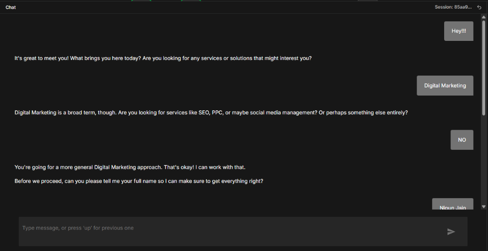
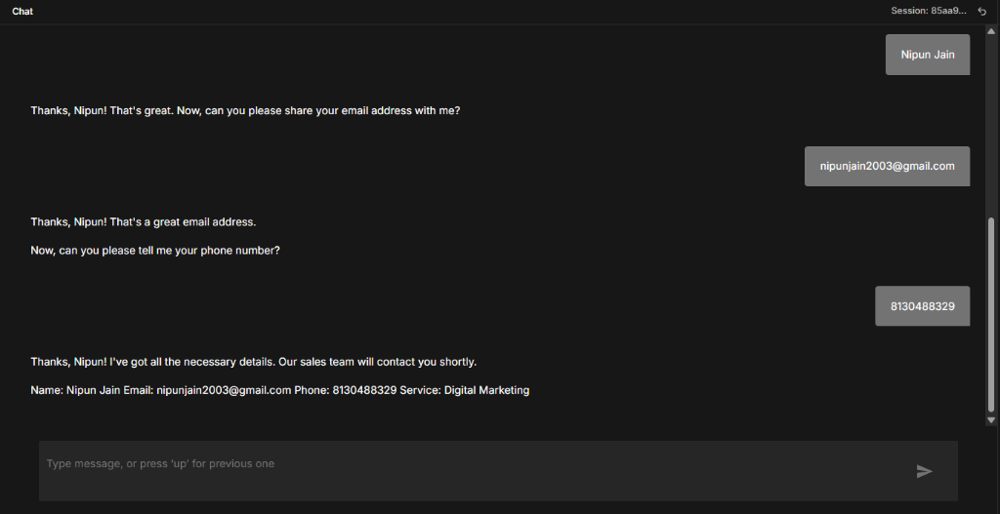
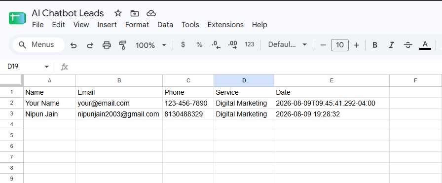
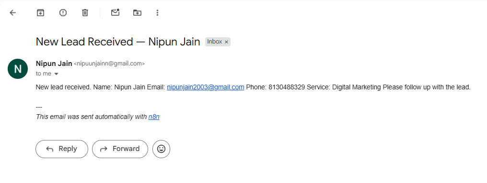

# AI Lead Capture & Management Chatbot

> An AI-powered chatbot built with **n8n**, **Ollama (Llama 3.2)**, **Google Sheets**, and **Gmail** that automates the full lead capture and notification pipeline — from conversational interaction to structured CRM storage and instant sales-team alerts.

---

## Overview

Manually handling inbound leads from a website chat is slow, error-prone, and inconsistent. Sales teams often receive incomplete information, miss leads entirely, or spend time on repetitive data-entry tasks instead of actually following up.

This project automates the entire lead capture workflow using an AI agent. A visitor opens the chatbot, has a natural conversation with the AI, and by the end of the chat, their full lead details — name, email, phone number, and service requirement — have been:

- Extracted and structured by a second LLM pass
- Stored in a Google Sheet for centralised CRM tracking
- Sent as a lead-notification email to the sales team
- Sent as a confirmation email to the lead themselves

The entire pipeline runs locally via Docker + n8n, with **zero external AI API costs** thanks to Ollama running Llama 3.2 on-device.

---

## Problem Statement

Most businesses that rely on website chat for lead generation face the same bottlenecks:

- **Incomplete lead data**: Users drop off before providing all required fields
- **Manual data entry**: Sales staff manually copy chat transcripts into spreadsheets or CRMs
- **Delayed follow-up**: No instant notification system means leads go cold
- **Inconsistent qualification**: Different agents ask different questions in different orders

These problems collectively reduce conversion rates and increase operational overhead.

---

## Solution

This chatbot solves the problem by combining a **conversational AI agent** with a **structured automation pipeline**:

1. The AI agent (Llama 3.2 via Ollama) progressively collects the four required fields — name, email, phone, service — in a friendly, natural conversation.
2. An **If node** acts as a gate: once the agent outputs the completion trigger phrase, the downstream pipeline activates.
3. An **Information Extractor** node (second Ollama pass) parses the agent's final message and structures the four fields into clean JSON.
4. The structured data is written to **Google Sheets** and simultaneously triggers two **Gmail** nodes — one notifying the sales team, one confirming receipt to the lead.

---

## Key Features

- **AI-powered conversational lead capture** — natural language, no rigid form
- **Progressive information collection** — asks only for the next missing field
- **Completion gating** — downstream pipeline only fires when all four fields are confirmed
- **Dual LLM nodes** — one for conversation (AI Agent), one for structured extraction (Information Extractor)
- **Conversation memory** — `Simple Memory` node retains full session context
- **Google Sheets integration** — leads appended with IST timestamp
- **Dual Gmail notifications** — sales-team alert + lead confirmation email
- **Local LLM inference** — Ollama + Llama 3.2, no external API costs
- **n8n workflow automation** — fully visual, no backend code required

---

## Architecture



---

## Tech Stack

| Technology | Purpose |
|---|---|
| **n8n** | Workflow automation — orchestrates all nodes and data flow |
| **Docker** | Local containerised deployment of n8n and Ollama |
| **Ollama** | Local LLM runtime — serves Llama 3.2 via HTTP |
| **Llama 3.2** | Conversational AI model (AI Agent) and extraction model (Information Extractor) |
| **Google Sheets** | Centralised lead storage with timestamp |
| **Gmail** | Automated email delivery — sales notification + lead confirmation |
| **n8n Chat Trigger** | Built-in chat widget that initiates the workflow |

---

## Workflow Explanation

### Node-by-Node Breakdown

| Node | Type | Role |
|---|---|---|
| **When chat message received** | Chat Trigger | Entry point — receives user message from the n8n chat widget |
| **AI Agent** | LangChain Agent | Drives the conversation; holds the system prompt; collects all four fields |
| **Ollama Chat Model** | LLM (Ollama) | Powers the AI Agent with Llama 3.2 |
| **Simple Memory** | Memory Buffer | Maintains conversation history across turns |
| **If** | Conditional | Checks whether the AI Agent's output contains the trigger phrase |
| **Information Extractor** | LangChain Extractor | Parses the agent's final message into structured JSON (name, email, phone, service) |
| **Ollama Chat Model1** | LLM (Ollama) | Powers the Information Extractor with Llama 3.2 |
| **Append row in sheet** | Google Sheets | Appends a new lead row including IST-formatted timestamp |
| **Send a message** | Gmail | Sends a confirmation email to the lead's provided email address |
| **Send a message1** | Gmail | Sends a new-lead notification to the sales team inbox |

### Data Flow

```
User message
  → AI Agent (Llama 3.2 + Memory)
    → [conversation turns until all 4 fields collected]
    → Final message with trigger phrase
      → If node (condition: true)
        → Information Extractor (Llama 3.2)
          → Structured JSON { name, email, phone, service }
            → Google Sheets (append row)
              → Gmail: Lead confirmation
              → Gmail: Sales notification
```

---

## Example Conversation

> **Note:** This is a representative example of how the chatbot converses. The actual model responses may vary slightly based on context.

```
User:     Hey!

Bot:      It's great to meet you! What brings you here today?
          Are you looking for any services or solutions?

User:     Digital Marketing

Bot:      Great! Before we proceed, can you please tell me
          your full name?

User:     Nipun Jain

Bot:      Thanks, Nipun! Can you please share your email address?

User:     nipunjain2003@gmail.com

Bot:      Thanks, Nipun! And what's your phone number?

User:     8130488329

Bot:      Thanks! I've captured your details. Our sales team will
          contact you shortly.

          Name: Nipun Jain
          Email: nipunjain2003@gmail.com
          Phone: 8130488329
          Service: Digital Marketing
```

---

## Setup & Installation

### Prerequisites

| Requirement | Notes |
|---|---|
| **Docker Desktop** | Used to run n8n |
| **Ollama** | Install from [ollama.com](https://ollama.com) |
| **Llama 3.2** | Pull with `ollama pull llama3.2` |
| **Google Account** | For Google Sheets + Gmail OAuth2 |
| **n8n account** (optional) | For n8n Cloud; or run self-hosted via Docker |

---

### Step 1 — Run n8n with Docker

```bash
docker run -it --rm \
  --name n8n \
  -p 5678:5678 \
  -v n8n_data:/home/node/.n8n \
  n8nio/n8n
```

Open n8n at `http://localhost:5678`.

---

### Step 2 — Run Ollama

```bash
# Install Llama 3.2
ollama pull llama3.2

# Start Ollama server (default port 11434)
ollama serve
```

> **Note:** If running n8n inside Docker, use `host.docker.internal:11434` as the Ollama base URL in the n8n Ollama credential.

---

### Step 3 — Import the Workflow

1. Open n8n (`http://localhost:5678`)
2. Go to **Workflows → Import from file**
3. Select `workflow/ai-lead-capture-chatbot.json`

---

### Step 4 — Configure Credentials

After importing, reconnect the following credentials inside n8n:

| Node | Credential Type | Notes |
|---|---|---|
| Ollama Chat Model | `Ollama API` | Point to `http://localhost:11434` (or `host.docker.internal:11434`) |
| Ollama Chat Model1 | `Ollama API` | Same as above |
| Append row in sheet | `Google Sheets OAuth2` | Authorise your Google account; create a Sheet with columns: Name, Email, Phone, Service, Date |
| Send a message | `Gmail OAuth2` | Authorise your Google account |
| Send a message1 | `Gmail OAuth2` | Update the `sendTo` field with your sales team email |

---

### Step 5 — Activate & Test

1. Click **Activate** on the workflow
2. Click **Open chat** (bottom of the editor) to open the chat widget
3. Start a conversation and provide your name, email, phone, and service
4. Verify:
   - Lead appears in your Google Sheet
   - Confirmation email arrives in the lead's inbox
   - Notification email arrives in the sales team inbox

---

## Results & Outcomes

The implemented automation delivers the following functional outcomes:

- ✅ **Fully automated lead collection** — no human intervention required during capture
- ✅ **Structured data storage** — every lead stored consistently in Google Sheets with a timestamp
- ✅ **Instant sales-team notification** — new-lead email triggered the moment all fields are captured
- ✅ **Lead confirmation** — automatic acknowledgement sent to the user
- ✅ **Zero manual data entry** — eliminates copy-paste from chat to spreadsheet
- ✅ **No external API costs** — Ollama + Llama 3.2 runs entirely on local hardware
- ✅ **Progressive UX** — chatbot never overwhelms users by asking for all fields at once

---

## Limitations

- **Local LLM performance** — Response speed depends on local hardware. GPU acceleration is recommended for faster inference.
- **No persistent memory across sessions** — The `Simple Memory` node (buffer window) retains context within a session only; memory is cleared when a new chat session starts.
- **Single-channel only** — Currently only available via the n8n chat widget; not yet integrated with WhatsApp, Telegram, or other channels.
- **No deduplication** — Duplicate leads (same email) are not currently detected or merged.
- **English only** — The system prompt and conversation flow are designed for English-language interactions.

---

## Future Improvements

The following enhancements are planned or possible extensions (not yet implemented):

- [ ] **CRM integration** — Push leads directly to HubSpot, Salesforce, or Notion
- [ ] **Lead scoring** — AI-based scoring of lead quality based on service type and responses
- [ ] **Deduplication** — Check Google Sheets for existing email before appending
- [ ] **Multi-channel deployment** — WhatsApp, Telegram, Slack via n8n channel integrations
- [ ] **Production deployment** — Move from local Docker to a VPS or cloud environment
- [ ] **Conversation analytics** — Track drop-off rates, average turns to completion, conversion
- [ ] **Human handoff** — Escalate to a live agent if the user requests it
- [ ] **Multi-language support** — Detect user language and respond accordingly

---

## Project Screenshots

### n8n Workflow Overview


*Complete n8n workflow showing all nodes and their connections.*

---

### Chatbot Interaction — Lead Collection


*The AI chatbot progressively collecting lead information — starting with service, then requesting name.*

### Chatbot Interaction — Lead Captured


*The chatbot completing the lead capture after all four fields are collected, confirming the details to the user.*

---

### Google Sheets — Lead Storage


*Captured leads stored in Google Sheets with Name, Email, Phone, Service, and Date columns.*

---

### Gmail — Sales Team Notification


*Automated new-lead notification email received by the sales team.*

---

## Author

**Nipun Jain**

- GitHub: [@nipuunjainn](https://github.com/nipuunjainn)

---

## License

This project is licensed under the MIT License. See [LICENSE](LICENSE) for details.
